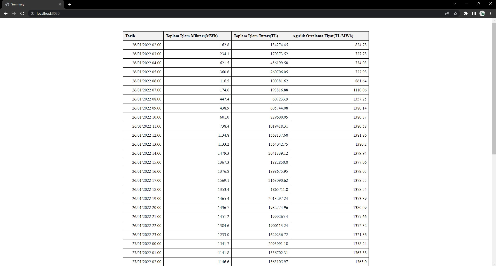

# SmartPulse Internship Coding Task

- [x] API’den gelen veriyi kullanılan programlama diline göre ihtiyacınız varsa kullanımınıza uygun formata çevirmelisiniz. (JSON vs.)
- [x] Contract değeri PB ile başlayan contractlar dikkate alınmayacak, sadece PH ile başlayanlar için işlem yapılacaktır.
- [x] Listedeki sınıfların conract değerlerine göre gruplanması ve bu grupladığınız conract değerine
  ait sınıflardaki price ve quantity değerlerini kullanarak, her bir conract için Toplam İşlem Miktarı, Toplam İşlem
  Tutarı ve Ağırlıklı Ortalama Fiyat değerlerinin elde edilmesi.

- [x] Her bir conract değeri, PHYYAAGGSS formatındadır. Yani conract değerinde PH’dan sonra gelen 2 karakterler
  sırasıyla yıl,ay,gün ve saati temsil eder. Gruplama yaptığınız conract için, bu tarih bilgisini conract değerinin
  içinden uygun DateTime formatına parse etmeniz gerekmektedir.
- [x] Son olarak program çalıştırıldığında ilgili hesaplamalar yapıldıktan sonra elde edilen veriler bir sonraki sayfada
  verilen örnek sonuç tablodaki gibi bir tabloda listelenmiş şekilde gösterilmelidir.

### Output
